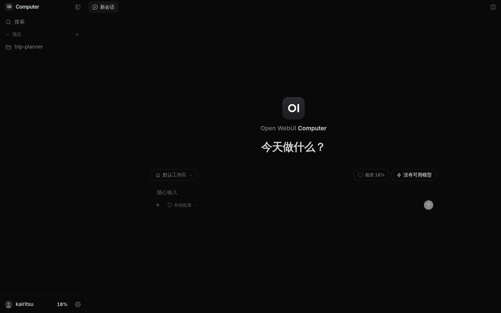
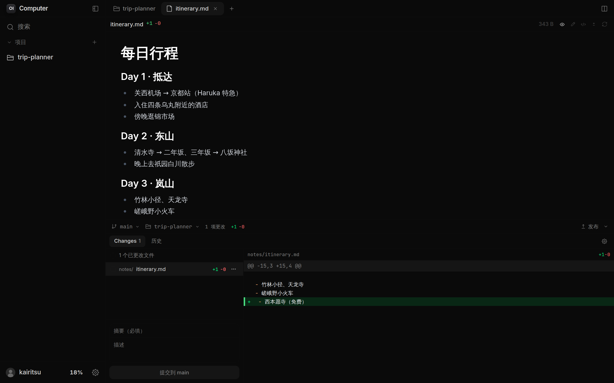
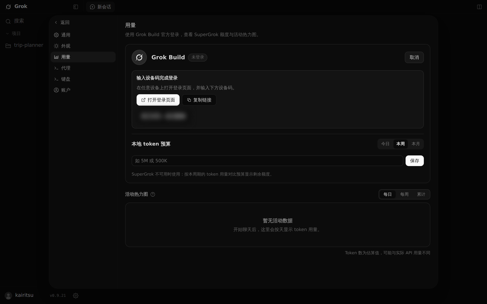

# Computer（Grok 版）

把私人服务器上的 Grok CLI 搬进浏览器。手机、平板、随便哪台电脑，打开网页就能用。

> **修改声明**：本项目是 [Open WebUI Computer](https://github.com/open-webui/computer) 的修改版本，由 [Kairitsu](https://github.com/Kairitsu) 在原版基础上改写，专门面向 Grok CLI。它不是 Open WebUI 的官方版本，和 Open WebUI, Inc. 以及 xAI 都没有任何关联。原项目版权归 Open WebUI, Inc. 所有，许可条款见 [LICENSE](LICENSE) 和文末的[法律声明](#法律声明)。



<sub>首页。截图用的是一台演示实例，Grok CLI 还没准备好，所以右上角显示“没有可用模型”；登录之后，这里会换成 Grok 的模型、思考强度和上下文长度选项。</sub>

## 为什么会有这个项目

用过 Claude 或 ChatGPT 的人，大概都习惯了这样一件事：打开网页，就有一个能读文件、能跑命令的 Agent 在云端替你干活。Claude 有 Cowork，ChatGPT 也有自己的工作模式。Grok 却一直没有推出这样的官方云端对话。

Grok 网页版只给了“快速”和“专家”两个档位。想让它多想一会儿，或者给它更长的上下文，都找不到地方调。其实这些能力在 Grok CLI 里都有：模型、思考强度、上下文长度都能选，它还能直接读写文件、执行命令。问题在于它只有命令行。习惯终端的人觉得无所谓，可要让不写代码的朋友去敲命令、记参数，基本就等于把他们挡在了门外。

市面上也有给 Grok CLI 做图形界面的应用，比如 [Grok App](https://github.com/RongleCat/grok-app)。但它们大多是给本机上的 Grok CLI 套一层壳：Grok 装在哪台电脑上，你就得守着哪台电脑。电脑性能一般的话，Agent 一跑起来风扇就开始叫；人在外面、电脑没带、手边只有手机或平板的时候，干脆就用不了。

能在云端跑的方案倒也有，比如 T3 Code，但它们基本都是 IDE 的样子：文件树、编辑器、终端，一切围绕写代码来设计。我想要的不只是写代码的工具，而是一个什么事都能交给它的通用 Agent。整理资料、写周报、规划一次旅行、顺手改个脚本，都可以找它。

所以我把 Open WebUI Computer 改成了现在这个样子。Grok CLI 装在我自己的服务器上，这个项目负责把它桥接到浏览器里。不管用的是手机、平板还是别人的电脑，只要能打开网页，就能像用 Claude Cowork 或 ChatGPT 的工作模式那样，在图形界面里使用 Grok CLI。思考强度、上下文长度这些原本只有命令行里才有的选项，现在都放在了输入框旁边，点一下就能改。

## 和原版有什么不同

原版 Open WebUI Computer 想做的是“把整台电脑搬进浏览器”：文件、终端、浏览器、Git、好几种接入 AI 的方式、各种聊天机器人，应有尽有。我只需要其中一部分，所以做了不少减法，又围绕 Grok CLI 补上了很多东西。

### 为 Grok CLI 做的事

- **直接和 Grok CLI 对话。** 后端通过 ACP 协议（`grok agent stdio`）驱动服务器上的 Grok CLI。每个对话在两轮之间会保留自己的 Grok 进程，这样 Grok 自带的上下文自动压缩才能正常工作。关掉对话的标签页，对应的进程也会跟着关掉。闲置进程最多保留几个、闲置多久后关闭，可以在“设置 → 通用”里调整，默认是 3 个和 30 分钟。
- **模型、思考强度、上下文长度随手可调。** 选项全部来自 Grok CLI 自己的模型目录，Grok 支持什么就显示什么，不会冒出它不认的选项。
- **上下文占用看得见。** 输入框旁边的圆环显示的是 Grok 实际的上下文用量（包括系统提示和工具结果），而不是按聊天文字粗估出来的数字。
- **三档工具权限。** “请求批准”会在每次调用工具前问你；“自动批准”对应 Grok 自己的自动审查，安全的操作直接执行，有风险的会被直接拒绝，不会来问你；“完全访问”则全部放行。
- **计划模式。** 先让 Grok 出方案，觉得没问题再点“批准并执行”；不满意就直接回复修改意见。Grok 在过程中提出的问题会以卡片的形式出现，点选就能回答。
- **在网页上登录 Grok。** “设置 → 用量”里可以用浏览器或设备码登录 Grok CLI，也能切换账号、退出登录，不用再 SSH 到服务器上敲 `grok login`。
- **额度和用量一目了然。** 同一个页面会显示 SuperGrok 套餐的剩余额度和重置时间，还有一张按天统计 token 用量的活动热力图。
- **界面参照 Grok App 重新设计。** 打开就是新对话；历史对话按项目归在侧边栏里，每个对话在自己的标签页中打开。另外加了六套配色皮肤，以及字号调节。
- **一条命令装好，点一下更新。** 安装只需要一行命令；以后有新版本，在网页左下角的菜单里点「检查更新」，看过更新内容就能一键升级，服务会自己重启。

### 删掉的东西

- 原版自带的“API 模型”对话引擎，也就是填 OpenAI、Anthropic 等 API key 直接聊天的那套功能，以及和它配套的工具调用、上下文压缩、标题生成、MCP / OpenAPI 工具服务器。
- 语音（语音模式、朗读、语音备忘）、图片生成、Telegram / Discord / Slack 等聊天机器人、OpenAI 兼容的网关 API、子代理、记忆、技能和网页搜索。
- 网页终端、内置浏览器标签页、多用户管理页面和 Git 设置页。

这些功能要么属于原版自己的模型循环，根本传不到 Grok CLI；要么需要另外配置 API key；终端和多用户在单人自用的服务器上也用不太到，需要时直接 SSH 上去就行。Grok CLI 本身就能读写文件、执行命令，也会加载它自己配置里的技能，留着这些功能只会让界面更乱。

### 保留下来的

文件浏览和编辑、Markdown 预览、Git 面板（看改动、提交、推送）、全局搜索（`Ctrl/⌘ + K`，聊天记录也能搜），还有原版那套为手机认真设计过的界面，都原样保留了下来。Grok 改过哪些文件，打开就能看到，确认没问题再提交。



<sub>打开服务器上的一个文件夹作为项目：上半部分是 Markdown 预览，下半部分是 Git 面板里的未提交改动。</sub>

原版对 Claude Code、Codex 等其他命令行 Agent 的适配代码也还在，但没有专门测试过，不保证好用。

## 开始使用

### 准备工作

- 一台能长期开着的服务器或电脑，Linux 或 macOS 都可以。家里闲置的主机、云服务器都行。
- 系统里要有 git 和 curl。Python 和 Node.js 不用提前准备：安装脚本会用 [uv](https://docs.astral.sh/uv/) 准备 Python；系统里的 Node.js 版本不够新的话，它会另外下载一份 Node.js 22，只给这个项目用，不影响系统里原有的。
- 一个能用 Grok CLI 的 xAI 账号，或者一个 xAI API key。登录方式和额度规则以 xAI 官方为准。
- 用一个普通用户来装，不要用 root，原因见下面的[安全提醒](#安全提醒)。

### 一键安装

在服务器上运行这一行：

```bash
curl -fsSL https://raw.githubusercontent.com/Kairitsu/computer/main/install.sh | bash
```

它会依次做完这些事：

1. 检查 uv 和 Node.js，缺什么补什么；
2. 服务器上还没有 Grok CLI 的话，用 xAI 官方的脚本装好；
3. 把代码下载到 `~/.local/share/computer`，构建前端，安装后端依赖；
4. 注册成后台服务并启动：Linux 上是名为 `computer` 的 systemd 服务，macOS 上交给 launchd，开机后都会自动运行；
5. 打印第一次访问用的地址。

一般几分钟就能装完，终端最后会显示类似这样的内容：

```
==> 安装完成（v1.0.0）
    第一次访问请打开下面的地址，创建管理员账号：
      http://192.168.1.20:8000/?token=3f9c…
```

用浏览器打开这个地址（从外网访问的话，把 IP 换成服务器的公网 IP 或域名），创建管理员账号，以后用账号密码登录就行。带 token 的链接只在首次设置时有用，服务每次重启都会换一个新的。

创建系统服务要用 sudo，脚本到这一步会请你输入密码；当前用户没有 sudo 权限的话，它会改装成当前用户自己的 systemd 服务。所有数据（数据库、设置、保存的 Grok 账号）都放在 `~/.cptr`，想换位置，运行安装命令前设置好环境变量 `CPTR_DATA_DIR`。

注意别直接 `pip install cptr`。PyPI 上的 `cptr` 是原版 Open WebUI Computer，不包含这里的任何修改。

#### 改端口、换位置

需要调整的时候，在命令末尾用 `bash -s --` 带上参数。比如改用 8080 端口：

```bash
curl -fsSL https://raw.githubusercontent.com/Kairitsu/computer/main/install.sh | bash -s -- --port 8080
```

| 参数 | 作用 |
| --- | --- |
| `--port 8080` | 换一个端口，默认是 8000 |
| `--host 127.0.0.1` | 只允许本机访问，适合前面已经有 Nginx 或 Caddy 反向代理的情况；默认是 `0.0.0.0`，局域网里的设备都能访问 |
| `--dir 路径` | 换一个安装位置，默认是 `~/.local/share/computer` |
| `--no-service` | 不创建后台服务，装好以后自己用命令启动 |
| `--no-grok` | 不安装 Grok CLI |

端口、监听地址和要不要后台服务这几项会被记下来，以后更新时自动沿用。

### 在网页里登录 Grok

打开“设置 → 用量”，就能看到 Grok 的登录卡片。如果你就坐在服务器前，用“浏览器登录”；如果是从手机或别的电脑访问，用“设备码登录”：点“打开登录页面”，在 xAI 的页面里输入卡片上的设备码，完成授权后回到这里就好。



<sub>设备码登录。网页会在服务器上运行 `grok login`，再把登录链接和设备码显示出来（截图里的设备码已打码）。</sub>

登录成功后，输入框上方的“没有可用模型”会换成 Grok 的模型列表，接下来就可以开始对话了。

如果你用的是 xAI API key，让服务启动时带上环境变量 `XAI_API_KEY` 就行，Grok CLI 会直接用它认证。用 systemd 的话，可以运行 `sudo systemctl edit computer`，加上一行 `Environment=XAI_API_KEY=你的key`，再重启服务。

### 从手机或其他设备访问

安装脚本默认监听 `0.0.0.0:8000`，同一网络里的设备访问 `http://服务器IP:8000` 就能打开。界面是按手机屏幕设计的，竖着拿也很好用。

不在同一个网络时，推荐用 [Tailscale](https://tailscale.com) 把手机和服务器连进同一个私有网络，简单又安全。如果想用域名访问，可以在前面加一层 Nginx 或 Caddy 反向代理，并且一定要开 HTTPS；反向代理记得同时转发 WebSocket，否则对话没法实时更新。

不建议把它不加任何保护地直接暴露在公网上，原因见下面的[安全提醒](#安全提醒)。

<p align="center"></p>

<p align="center"><sub>在手机上打开的首页。</sub></p>

### 管理后台服务

```bash
sudo systemctl status computer     # 查看运行状态
sudo systemctl restart computer    # 重启
sudo systemctl stop computer       # 停止
journalctl -u computer -f          # 查看日志
```

如果装的是当前用户自己的服务，把 `sudo systemctl` 换成 `systemctl --user`，`journalctl` 后面也加上 `--user`。macOS 上的日志在 `~/.cptr/logs/service.log`。

### 手动安装

<details>
<summary>不想用安装脚本的话，也可以一步步手动来</summary>

需要提前装好 git、Node.js 22 和 [uv](https://docs.astral.sh/uv/)。

```bash
# Grok CLI（默认装在 ~/.local/bin）
curl -fsSL https://x.ai/cli/install.sh | bash

git clone https://github.com/Kairitsu/computer.git
cd computer

# 构建前端
cd cptr/frontend
npm ci
npm run build
cd ../..

# 安装后端依赖（会在项目目录里创建 .venv）
uv sync --extra all

# 启动
.venv/bin/cptr run --host 0.0.0.0 --port 8000 --headless
```

启动后终端会打印一个带 token 的地址，第一次访问用它创建管理员账号。想让它常驻后台，可以写一个 systemd 服务，把里面的用户名和路径换成你自己的：

```ini
[Unit]
Description=Computer (Grok)
After=network.target

[Service]
User=alice
WorkingDirectory=/home/alice/computer
# PATH 里要包含 grok、uv 和 node 所在的目录
Environment=PATH=/home/alice/.local/bin:/usr/local/bin:/usr/bin:/bin
ExecStart=/home/alice/computer/.venv/bin/cptr run --host 0.0.0.0 --port 8000 --headless
Restart=on-failure

[Install]
WantedBy=multi-user.target
```

这样用 git 克隆、`uv sync` 装好的，同样可以在网页里更新。

</details>

## 更新

### 在网页里更新

点左下角的头像打开菜单，选「检查更新」，程序会去 GitHub 上看看有没有新代码：

- 已经是最新的，它会直接告诉你；
- 有新版本时，先列出这次的更新说明和新增的提交，看完再决定要不要更新；
- 点「立即更新」后，它会拉取代码、安装依赖、重新构建前端，然后自己重启。一般一两分钟就好，页面会自动刷新，并弹出这次的更新记录。

另外几点：

- 这个入口只有管理员能看到。打开网页时如果发现有新版本，右下角也会弹出提示，不想看的话可以在“设置 → 通用 → 更新”里关掉。
- 更新完会重启服务，正在进行的对话会被打断。如果有对话还在运行，点更新前它会先提醒你。
- 中途任何一步出错，代码都会退回到更新前的版本，服务照常运行。具体原因可以在对话框里点「查看日志」看。
- 如果你在服务器上直接改过代码又没有提交，为了不覆盖这些改动，更新会先停下来，并列出改过的文件。

### 用命令行更新

再运行一次安装命令就行。脚本发现已经装过，就只拉取新代码、重新构建，然后重启服务：

```bash
curl -fsSL https://raw.githubusercontent.com/Kairitsu/computer/main/install.sh | bash
```

安装时设置过的端口等参数会自动沿用；只有用 `--dir` 换过安装位置的，这里要带上同样的 `--dir`。

1.0.0 之前照旧版说明手动安装的，先用原来的办法更新一次（`git pull`、重新构建前端、`uv sync`、重启服务），之后就能直接在网页里更新了。

## 用起来的几个建议

- **项目和默认工作区。** 在侧边栏“项目”旁边点“+”，选服务器上的一个文件夹，在这个项目里发起的对话，Grok 就会在这个文件夹里干活。不属于任何项目的对话放在“默认工作区”，Grok 会在运行这个服务的用户的主目录下工作。
- **先用“请求批准”熟悉一下。** 刚开始可以让 Grok 每做一步都问你一句，摸清它的习惯以后再换成“自动批准”。“完全访问”适合你完全清楚它要做什么的场景，比如在一个有备份的项目里批量改文件。
- **小内存服务器注意进程数。** 每个 Grok 进程会占用几百 MB 内存（加载 MCP 服务器时大约 450 MB）。如果服务器内存不大，可以在“设置 → 通用 → Grok 进程”里把闲置进程的数量调小，或者缩短闲置多久后自动关闭的时间。正在工作的进程永远不会被关掉。
- **复杂任务先开计划模式。** 输入框左下角的“+”里可以打开计划模式，让 Grok 先把思路讲清楚，你确认之后再动手。

## 安全提醒

这个项目的设计前提是“你自己的服务器，只给你自己用”。登录网页的人，能做到运行这个服务的系统用户能做的所有事，相当于拿到了一个 SSH 会话；Grok 在“完全访问”模式下执行命令也不会再问你。所以：

- 不要用 root 运行，最好单独建一个普通用户来跑；
- 管理员密码设得复杂一些（自助注册默认是关闭的）；
- 不要在公网上用明文 HTTP 访问，优先使用 Tailscale 这类私有网络，或者加上 HTTPS；
- 重要的文件提前备份。AI Agent 会改文件、删文件、执行命令，出了问题很难挽回。

## 常见问题

**输入框上方一直显示“没有可用模型”？**

多半是 Grok CLI 还没登录，去“设置 → 用量”登录一下。如果还是不行，打开“设置 → 代理”，看看 Grok 的检测状态。找不到 `grok` 命令的话，可以在那里手动填写它的完整路径，比如 `/home/alice/.local/bin/grok`。

**点「检查更新」时提示无法在应用内更新？**

应用内更新要求代码目录是一个 git 仓库，并且程序是从这个目录里装的（一键安装和上面的手动安装都是这样）。如果是用 wheel 包或者 `pip install .` 装的，用一键安装脚本重新装一次就好，`~/.cptr` 里的数据不受影响。

**能用 Docker 部署吗？**

仓库里的 `Dockerfile` 是原版留下来的，镜像里没有 Grok CLI，暂时不建议用。

**Windows 能用吗？**

目前没有在 Windows 上测试过。推荐用 Linux 服务器，或者在 Windows 上通过 WSL 运行。

**本地开发怎么跑？**

构建好前端以后运行 `./dev.sh`（需要 uv）。它会以热重载模式启动在 9741 端口，数据放在项目目录下的 `.cptr` 里。

## 法律声明

- **原项目与版权。** 本项目基于 [Open WebUI Computer](https://github.com/open-webui/computer) 修改而来。原项目 Copyright © 2026 Open WebUI, Inc.，保留所有权利，按 Open Use License 授权。该许可证完整纳入了 Elastic License 2.0（ELv2），并附加了“署名保留”条款，全文见 [LICENSE](LICENSE)。本仓库的全部内容，包括我的修改，同样按照这份许可证提供。应用内“设置 → 通用”中保留了原项目的许可证与版权信息。
- **修改说明。** 本仓库相对原版做了大量修改，主要内容见上文[和原版有什么不同](#和原版有什么不同)，各版本的变化见 [CHANGELOG.md](CHANGELOG.md)，完整记录见 git 提交历史。修改者：Kairitsu。
- **使用限制。** 按照许可证的规定，不得把本软件作为托管服务（hosted or managed service）提供给第三方；不得删除、修改、遮盖或替换软件中的任何署名元素（包括标志、产品名称、版权声明等）；商业、组织或生产环境的使用，需要遵守 [Open WebUI 的商业条款](https://openwebui.com/terms)，或者另外取得 Open WebUI, Inc. 的书面许可。个人自用之外的场景，请先仔细阅读 LICENSE。
- **商标。** Open WebUI 是 Open WebUI, Inc. 的商标；Grok、SuperGrok、xAI 及相关标志属于 xAI。界面中出现的 Grok 名称和标志，只用来表明本项目连接的是哪个服务。本项目与 Open WebUI, Inc.、xAI 均无关联，也没有得到它们的认可或支持。
- **Grok 的使用。** 通过本项目使用 Grok CLI 时，你仍然需要遵守 xAI 的服务条款和订阅规则。本项目不提供任何 Grok 账号、API key 或额度。
- **免责声明。** 本软件按“原样”提供，不附带任何形式的明示或默示担保。AI Agent 可能修改或删除文件、执行命令，由此造成的数据丢失或其他损失，由使用者自行承担。

## 致谢

- 感谢 Open WebUI 团队和 Tim Baek 做出了 Open WebUI Computer，这个项目的大部分功劳属于他们。
- 感谢 [RongleCat/grok-app](https://github.com/RongleCat/grok-app)。本项目的 UI 设计参考了这个开源的 Grok 桌面客户端：首页、输入框、侧边栏、开场动画和用量页的布局都借鉴了它的做法，用量页上的 Grok 标志图形也取自这个项目。
- 感谢 xAI 提供了 Grok CLI。
